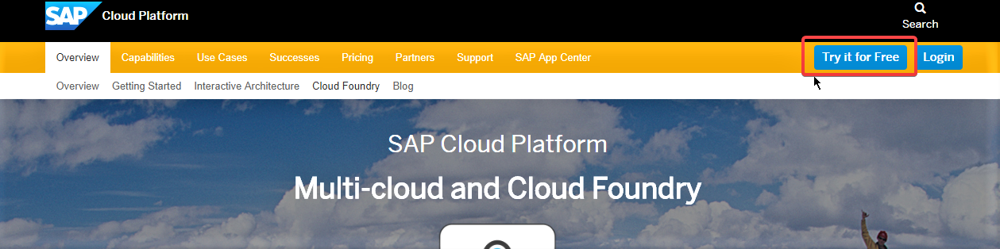
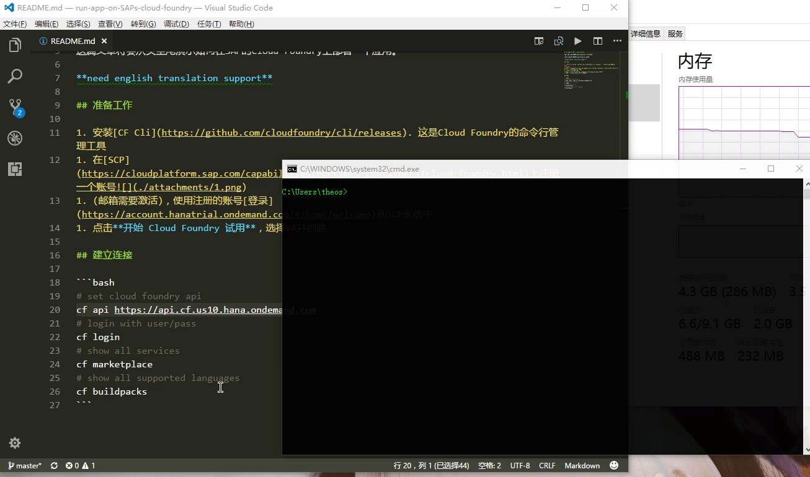
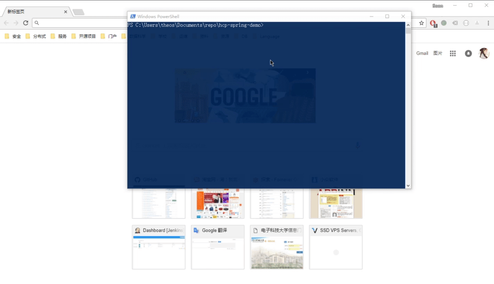

# run app on SAP's Cloud Foundry

Yap, SAP提供有限而不限时长的Cloud Foundry使用，不过使用方式略微麻烦。

这篇文章将会从头至尾演示如何在SAP的Cloud Foundry上部署一个应用。

**need english translation support**

## 准备工作

1. 安装[CF Cli](https://github.com/cloudfoundry/cli/releases). 这是Cloud Foundry的命令行管理工具
1. 在[SCP](https://cloudplatform.sap.com/capabilities/runtimes-containers/cloud-foundry.html)上注册一个账号
1. (邮箱需要激活)，使用注册的账号[登录](https://account.hanatrial.ondemand.com/#/home/welcome)到SCP系统中
1. 点击**开始 Cloud Foundry 试用**，选择VA并创建

## 建立连接

注册完毕之后，开始准备与CF建立连接



打开terminal，利用**CF Cli**与CF建立连接

```bash
# set cloud foundry api
cf api https://api.cf.us10.hana.ondemand.com
# login with user/pass
cf login
# show all services
cf marketplace
# show all supported languages
cf buildpacks
```

支持的Service


## build，deploy

如果你对于Cloud Foundry平台有一定了解，现在你就可以部署应用并离开这个页面。

如果没有相关经验，我们可以先看看平台支持哪些语言。

---

Cloud Foundry中的`buildpack`并不是真正的**build** pack，被称作**runtime pack**其实更合适。

```bash
C:\Users\theos>cf buildpacks
Getting buildpacks...

buildpack               position   enabled   locked   filename
staticfile_buildpack    1          true      false    staticfile-buildpack-v1.4.12.zip
java_buildpack          2          true      false    java-buildpack-v3.19.zip
ruby_buildpack          3          true      false    ruby-buildpack-v1.6.46.zip
nodejs_buildpack        4          true      false    nodejs-buildpack-v1.6.4.zip
go_buildpack            5          true      false    go-buildpack-v1.8.6.zip
python_buildpack        6          true      false    python-buildpack-v1.5.22.zip
php_buildpack           7          true      false    php-buildpack-v4.3.39.zip
binary_buildpack        8          true      false    binary-buildpack-v1.0.14.zip
dotnet_core_buildpack   9          true      false    dotnet-core-buildpack-v1.0.23.zip
sap_java_buildpack      10         true      false    sap_java_buildpack-v1.6.10.zip
```

cloudfoundry可运行包括`java, go, node, python`在内的主流应用。

以`java_buildpack`为例，只需要指定jar/war包即可运行，一个典型的java应用配置文件如下

```yml
---
applications:
-   # app的名字，使用cf apps时会显示出来
    name: spring-boot-demo

    # 使用随机的路由(URL)。
    # 默认情况cf会申请以name为开头的url
    # 使用随机的后缀以避免url冲突
    random-route: true

    # 内存限制，简单的Spring Boot内存占用在300M左右
    memory: 500M

    # maven构建的jar包路径，如果版本和名字不一样，需要修改
    path: target/demo-1.0.0.war

    # 使用java构建包，主要是包含一个java环境
    buildpack: java_buildpack

    # run "cf create-service postgresql v9.6-dev psql" to create service instance before first push
    # bind a DB instance to this application
    services:
    - psql

    # spring profile
    env:
      SPRING_PROFILES_DEFAULT: cf-production
```

这一份文档并不关注如何编写一个应用，请clone[这个仓库](https://github.com/Soontao/hcp-spring-demo)

在项目路径运行如下命令，即可在Cloud Foundry上部署一个spring boot应用

请确定**maven**以及**java**已经配置正确

```bash
# clone sample project
git clone https://github.com/Soontao/hcp-spring-demo
cf hcp-spring-demo
# package war file, profile is necessary
mvn package -Plog
# create a database instance (only need to be executed onece)
cf create-service postgresql v9.6-dev psql
# deploy to cloud foundry
cf push
```



如果成功的话，访问你的route即可。

需要注意的是，这个Sample Application根路径下是没有映射，需要访问`https://cfapps-url/rest`才有内容
